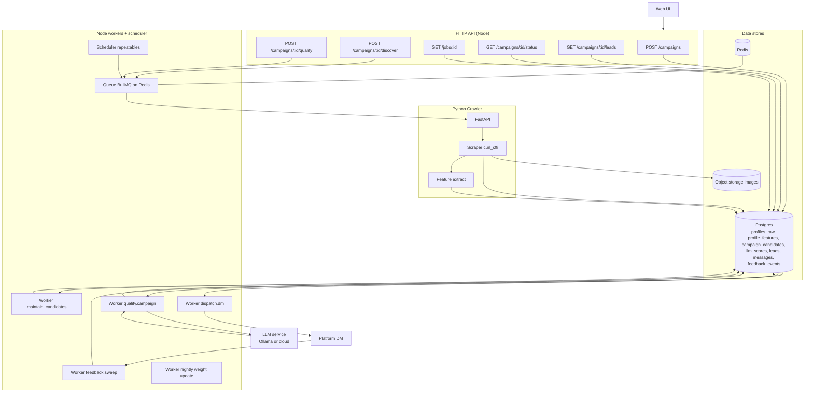

# Architecture and Data Flow

# Omni MVP Architecture and Data Flow



```mermaid
flowchart TD
  A[Create campaign\nPOST /campaigns] --> B[Compile SQL predicate\nstore criteria_hash]
  B --> C[Discover\nPOST /campaigns/:id/discover]
  C --> D[Enqueue crawl.seed]
  D --> E[Python scrape]
  E --> F[Compute content_hash]
  F --> G{hash changed?}
  G -- no --> H[Update last_seen only]
  G -- yes --> I[Write profiles_raw\npayload + hash]
  I --> J[Enrich features\nwrite profile_features\nwith version_hash]
  J --> K[Maintain campaign_candidates\nupsert or evict by compiled WHERE]
  K --> L[Daily qualify.campaign]
  L --> M[Shortlist K by cheap score and recency\nskip where cached llm_scores\n(profile_hash, criteria_hash)]
  M --> N[LLM evaluate\ntext + up to 3 image URLs]
  N --> O[Write llm_scores and leads]
  O --> P[Dispatch.dm with rate limits\nper account]
  P --> Q[Send DMs\nrecord messages]
  Q --> R[Ingest feedback events]
  R --> S[Nightly weight update per campaign\nupdate cheap feature weights]
  S --> T[Next day cheap score improves\nfeeds new shortlist]
```
